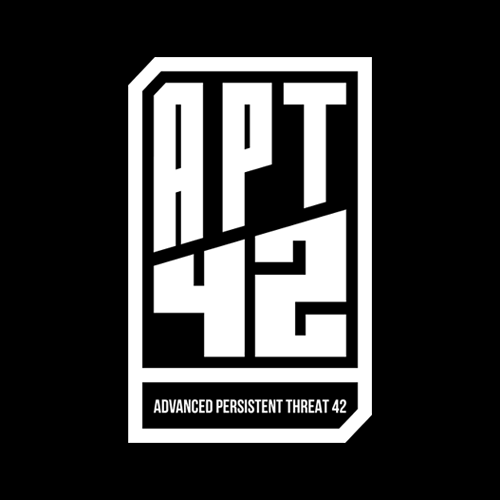

  

<h1 align="center">
  CTF OSINT
</h1>
<h3 align="center">
  Conduct an online investigation and discover OSINT techniques
</h3>

### Table of Contents

- [Project](#project)
- [Acknowledgements](#acknowledgements)
- [How to contribute](#how-to-contribute)
- [License](#license)

## Project

This project is a CTF hosted by APT42.

It runs as a Capture the Flag format where students have to collect flags to validate levels. Learn OSINT basics by solving challenges that focus on GEOINT, IMINT, SOCMINT and investigative journalism techniques.

APT42 is a student organization of the Paris campus of the school 42. We aim to foster interest in information security and to provide a safe and inclusive space for everyone to learn and improve their cybersecurity skills.

### Intended audience

Students who aim to work as:

- OSINT analysts
- Online investigators
- Penetration testers
- Data journalists
- Investigative journalists

### Prerequisites

Basic knowledge of the internet, computers, search engines, and social networks.

## Acknowledgements

### Contributors

* Mathilde Boivin (mboivin)
* Wil (wandre)
* (avan-pra)
* (therbret)

### Beta-testers

* Firstname Name (login)
* ...

## How to contribute

You are a 42 student and willing to contribute? Follow these [guidelines](CONTRIBUTING.md).

## License

This work is licensed under a
[Creative Commons Attribution-ShareAlike 4.0 International License](http://creativecommons.org/licenses/by-nc/4.0/).
