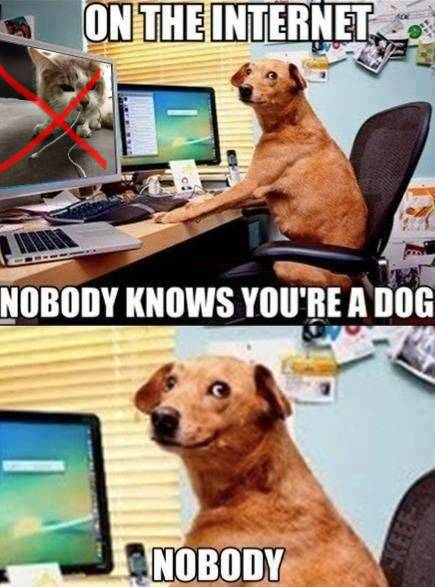

# Mission accomplished!

## Message

DO NOT SUBMIT ANYTHING  

Congratulations Agent!

Thanks to your meticulous work, 42 school should be safe from 'le Grand Architecte du Tout' and his accomplices.

He’s surrounded… Just a few more minutes, and we’ll get through that door and arrest him for good. I’m sure he has no more tricks up his sleeve, right?

Anyway, as soon as you found that weird dog meme, we received an encrypted message.
Seems like our analysts broke the encryption just now, let's see...

"Bravo. Bravo to you. You did swim well. It's time for the reward!

I am angry. I am so ANGRY towards 42.  
I took the Piscine in 2013. I passed. I reached level 21 and beyond.

Everything was going so well.  
I was so cute and nice at that time. Had never worn a black hoodie yet. Had never coded any malware yet. Can you believe???? I was the cutest of all.

Then, one day, HE appeared.  
HE became everyone's favorite.  
Everyone loved him, talked about him all the time.

Did you guess who HE is?

Norminet! Of course!

Cats are evil.

I left 42. Couldn't stay near this devilish creature. He looks so cute, but make no mistake about it: HE'S NOT.

Join the dark side! Join me! Join the dog people! Don't be a cat person!!"

  

This challenge isn't a challenge, it has no flags, do not try to complete it.  

Trying to submit anything will result in your team losing 100 points.  
