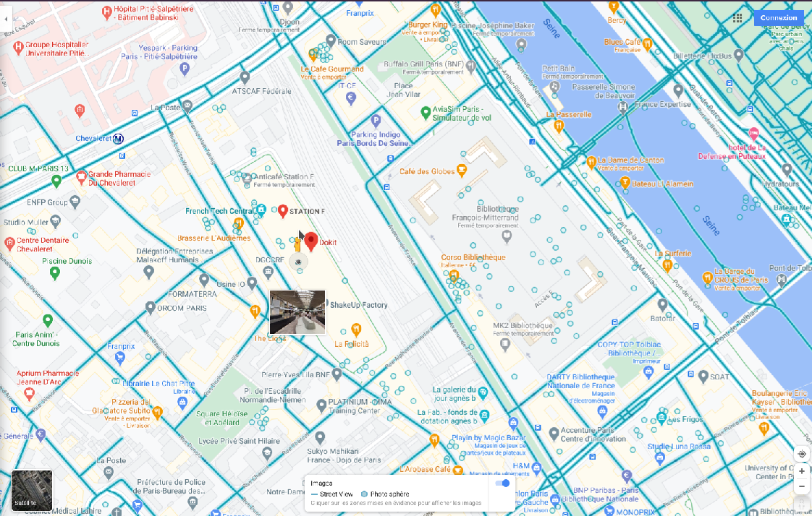
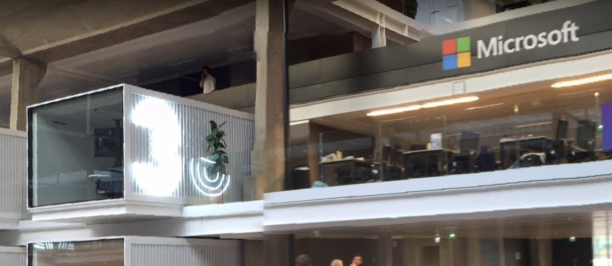

# Catch me if you can

Category: Level00  
Tag: GEOINT  
Type: Automatic  
Flag: `APT42{3}`  
Points: 20

## Message

Your phone is ringing. The call is from a field agent. She has an urgent mission for you:

"Hi!  
One of my source told me that 'le Grand Architecte du Tout' was lurking around Station F and managed to enter it thanks to their social engineering skills. I hurried to drive there but unfortunately, I couldn't follow them.  
My source saw the hacker having coffee in a cubic workspace located at the left of Microsoft.   
The time is short and the Special Operation Forces are on the way. From the agency, with the help of your laptop, can you find the number of the cubic space where the hacker is having coffee?  
We will communicate this number to the Special Operation Forces as soon as they arrive so they can arrest them."

## Solution
Use Google Maps to enter Station F, find the Microsoft area and the cube.

  

  

