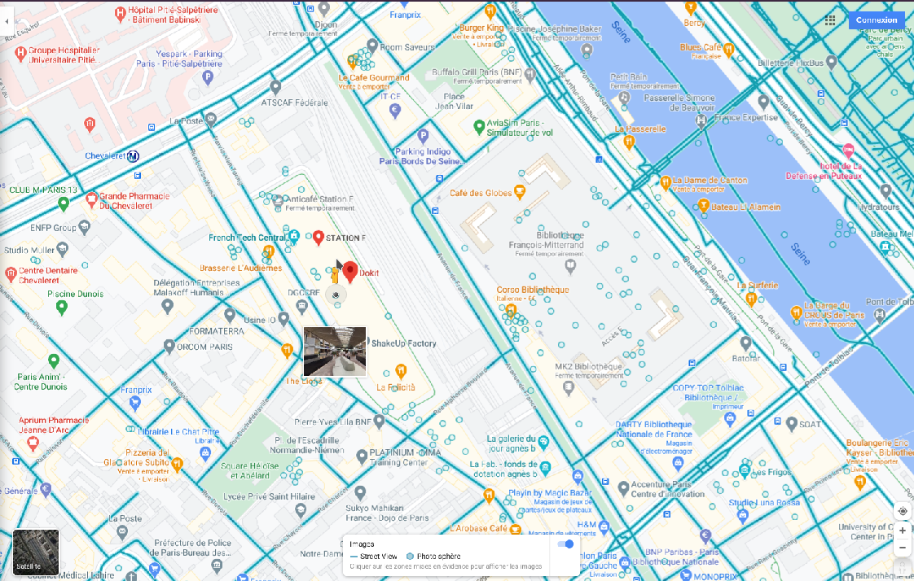

# Catch me if you can

Category: Level00  
Tag: GEOINT  
Type: Automatic  
Flag: `APT{9fbf261b62c1d7c00db73afb81dd97fdf20b3442e36e338cb9359b856a03bdc8}`  
Points: 10
Requirements: wandering wandre

## Message

Congratulations! The field agent is calling you again:

"Hey! We sent the message you found to our profiler. It will be very useful to understand the motives of 'le Grand Architecte du Tout'.  
He managed to enter Station F thanks to their social engineering skills. I hurried to drive there but unfortunately, I couldn't follow them.  
Edward Snowcrash said he managed to hack Station F camera systems. According to him, the hacker is having coffee in a compagny workspace. Ed sent us a picture of a place located at the left of this workspace. The picture is truncated again and I find this suspicious.  
The time is short and the Special Operation Forces are on the way. From the agency, with the help of your laptop, from the attached picture, can you find where the hacker is having coffee?  
We will communicate this name to the Special Operation Forces as soon as they arrive so they can arrest them."

<p align="center">
  
</p>

To solve this challenge, submit the SHA-256 hash of the lower-cased company name.

For example, if Framasoft is the company name, you would write it in lower-case letters as follows:
```
echo -n framasoft | sha256sum
15917111876bec347732074c45c3eeb33df156b664da2f443a5b9ea74cf195b9
```

Submit the flag as follows:  
`APT{15917111876bec347732074c45c3eeb33df156b664da2f443a5b9ea74cf195b9}`

## Solution

Use Google Maps to enter Station F.

<p align="center">
  
</p>
