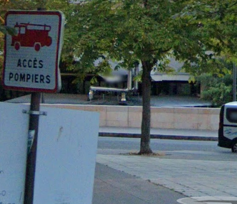

# wandering wandre

Category: Level00  
Tag: GEOINT  
Type: Automatic  
Flag: `APT42{CAC40}`  
Points: 20
Requirements: Your Mission

## Message

Your phone is ringing. The call is from a field agent. She has an urgent mission for you:

"Hi!  
One of my source told me that 'le Grand Architecte du Tout' was lurking around Station F.  
My source saw the hacker writing a message under a firemen sign and took a picture, but unfortunately the picture seems truncated.  
Can you find the whole message?"

  

To solve this challenge, submit the fourth word of the message (5 characters).

## Solution

Use Google Maps.

  

