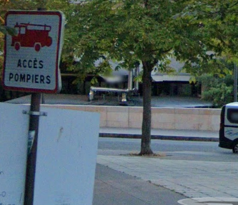
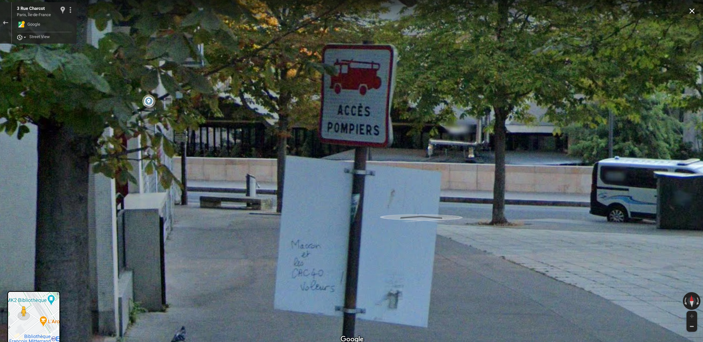

# wandering wandre

Category: Level00  
Tag: GEOINT  
Type: Automatic  
Flag: `APT{fe8d800d80298868cb10a352953eac038ccdbd677174c77e36fd24b873114c09}`  
Points: 20
Requirements: Your Mission

## Message

Your phone is ringing. The call is from a field agent. She has an urgent mission for you:

"Hi!  
One of my sources, Edward Snowcrash, told me that 'le Grand Architecte du Tout' was lurking around Station F.  
Ed saw the hacker write a message under a firemen sign and took a picture, but unfortunately the picture seems truncated.  
Can you find the whole message?"

<p align="center">
  
</p>

To solve this challenge, submit the SHA-256 hash of the fourth word of the message (5 characters long).

For example, if MyFlag42 is the word:
```
echo -n MyFlag42 | sha256sum
95923b9abe28b5b9bb6924e8c5d79b8128ce9a52797cc252b8061454f85136ee
```

Submit the flag as follows:  
`APT{95923b9abe28b5b9bb6924e8c5d79b8128ce9a52797cc252b8061454f85136ee}`

## Hint (cost: 5 pts)

Did you give Gmaps a try?

## Solution

Use Google Maps.

<p align="center">
  
</p>

echo -n CAC40 | sha256sum 
fe8d800d80298868cb10a352953eac038ccdbd677174c77e36fd24b873114c09

