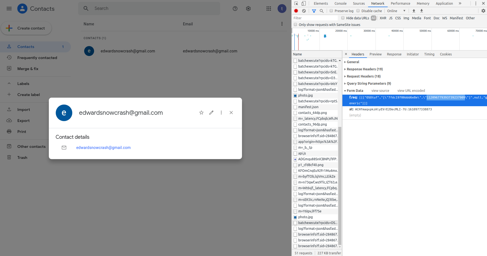
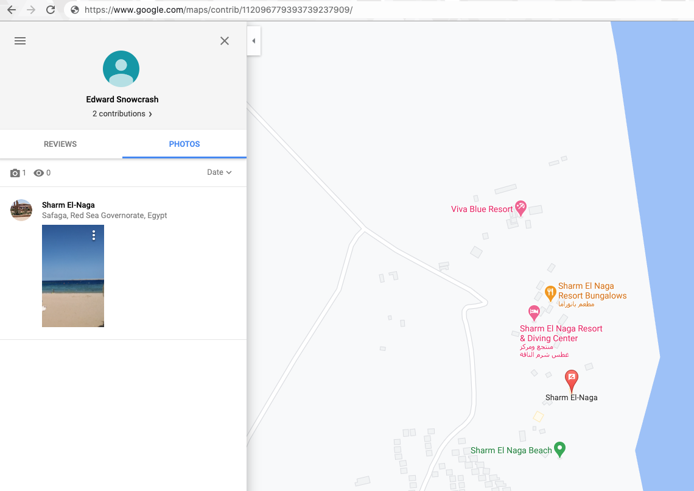
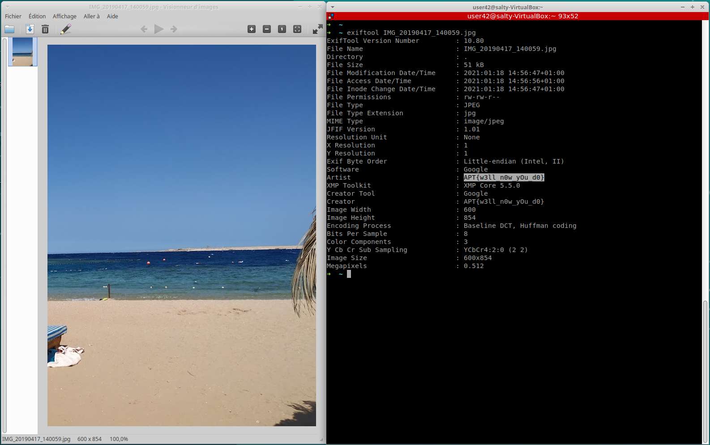

# You know Google?

Category: Level01  
Tag: SOCMINT  
Type: Automatic  
Flag: `APT{w3ll_n0w_yOu_d0}`  
Points: 35  
Requirements: Palmistry

## Message

*bip* \* You answer your phone instantly; You yell at the phone: "DID WE FOUND HIM ?"  
"Agent, nice to hear you, sadly, only bad news from over here, the fingerprint you found... is only linked to one thing"  
"What is it ?" you reply  
"You won't like it, an e-mail, Edward Snowcrash's e-mail, Edward disapeared from all radar, is he a traitor ? Who knows. As of now i need you to find his last location. Some intel suggest he went on holidays, here is his e-mail: edwardsnowcrash@gmail.com  
We need Edward to answer his supposedly betrayal. Good luck agent."

## Solution

1. Get google ID of account, one way is to add the e-mail to your contact, open dev tools and then click on the contact, check the batchexecute request, scroll all the way to the end and grab the ID  

2. Check account contribution to gmaps, use https://www.google.com/maps/contrib/ + ID (in this case the link will be https://www.google.com/maps/contrib/112096779393739237909)  

3. Grab the photo and get the exif data, the flag will appear in clear sight  

