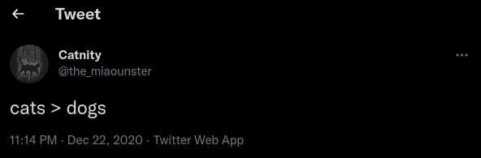
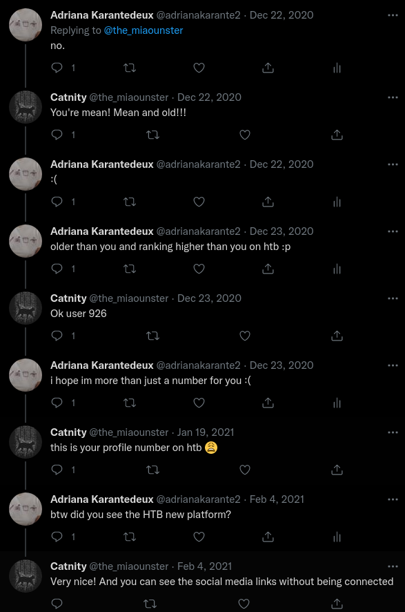

# Ok user

Category: Level01  
Tag: SOCMINT  
Type: Automatic  
Flag: `APT{4a52132263f898dd28098e11f493cf182ee78bfa916122237df0646ccf8730ad}`  
Points: 30
Requirements: Follow the white rabbit

## Message

Good job Agent! You discovered what seems to be the Twitter account of 'le Grand Architecte du Tout'. We need more information to identify him.

Since wandre was a student at 42, he may have uploaded his code somewhere. What do you think? Can you check if he has an account on any code hosting platform?

To solve this challenge, submit the SHA-256 hash of the account URL without `https://` and without the terminating slash.

For example, if `https://foo.com/test/` is the URL:
```
echo -n foo.com/test | sha256sum
124817c7b2d51964dd18af0cf63a4c2a4719ae03a8cce83bba6b6b71aac1ec1b
```

Submit the flag as follows:  
`APT{f29b6dda0984901faa692dc84e8a7392c9bd6c558d1cbdcd5ed7b753bdfdfad6}`

## Solution




Find the HTB account of adriana in a twitter thread. A Github account is linked on the HTB profile. It's easier to see it from the new HTB platform: `app.hackthebox.eu/profile/926`

```
echo -n github.com/0x927 | sha256sum
4a52132263f898dd28098e11f493cf182ee78bfa916122237df0646ccf8730ad
```
