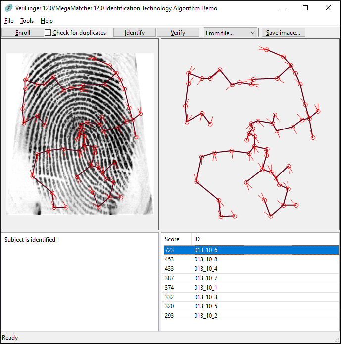

# Palmistry

Category: Level01  
Tag: ???  
Type: Automatic  
Flag: `APT{22b6c2531e8514dd1cc8b91cb34c7f7c5a1c4db962f4323254dc6297fb4b65a3}`  
Points: 15  
Requirements: Catch me if you can

## Message

Congratulations! The field agent is calling you again:

bip bip Your phone is ringing, the field agent is calling you again!

We just arrived at the location you manage to pinpoint nearby Station F. Sadly the hacker was already gone, lucky us thanks to the heat of his coffee he probably left this place about 30min ago. Not only this, but we manage to get his fingerprint from his coffee cup he left in the place ! I linked you an archived which contains fingerprints from numerous know hacker, maybe he is one of them.

To solve this challenge, submit the SHA-256 hash of the filename from the archive which correspond to the hacker fingerprints.

For example, if the filename is 085_10_6.tif, then submit: 
`APT{2b927e1a9d5a2e22768a8e16f291cc5d051d0180e65cd439fe8cfda98119bac3}`

## Solution

Use a tool like verifinger to identify the right fingerprint

