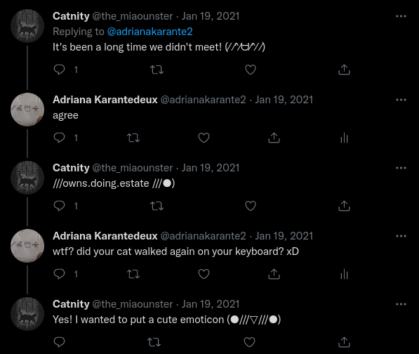
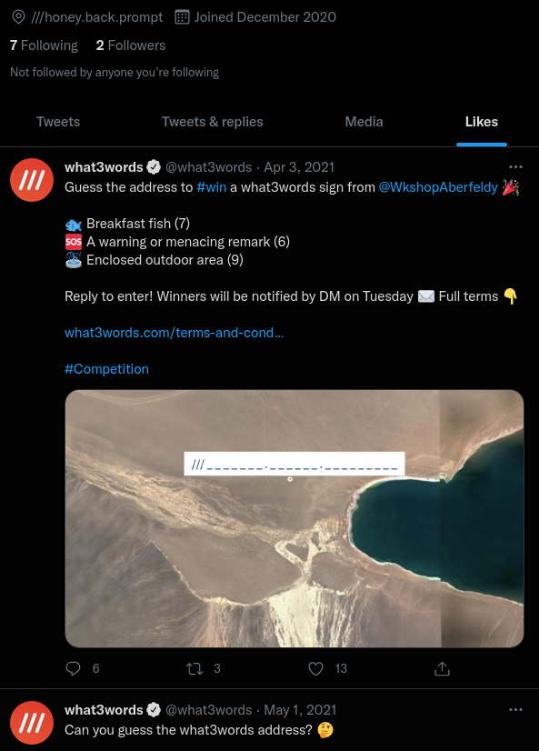
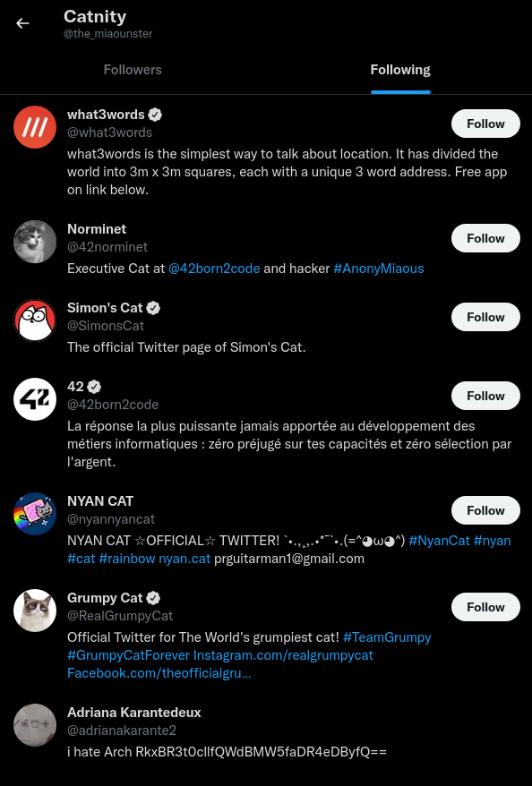

# R.D.V

Category: Level01  
Tag: SOCMINT/GEOINT  
Type: Automatic  
Flag: `APT{f277827ebc2a012aa1d958f86206a11f3355a83841201e2ec834f0a2842815f4}`  
Points: 40
Requirements: Follow the white rabbit

## Message

You just received an email informing you that Edward Snowcrash was arrested. He was interrogated and confessed that 'le Grand Architecte du Tout' used to meet at some regular place with another accomplice. This accomplice is apparently fond of cats and a social engineering specialist. Can you find their *lieu de R.D.V*? We need to arrest both of them.

To solve this challenge, submit the SHA-256 hash of the city where they meet. Pay attention to capital letters.

For example, if My_Flag is the flag:
```
echo -n My_Flag | sha256sum
f8fa66e084281bb87f40b2f7048ceb93c28dd6e282f98f43a2cd4396245a7404
```

Submit the flag as follows:  
`APT{f8fa66e084281bb87f40b2f7048ceb93c28dd6e282f98f43a2cd4396245a7404}`

## Hint (cost: 10 pts)

Did the cat really walked on the keyboard?

## Solution

Catnity account is archived [here](https://web.archive.org/web/20220122133827/https://twitter.com/the_miaounster).




Catnity posted `///owns.doing.estate` on their twitter. Enter these 3 words in: https://what3words.com/, open it in Gmaps, see it's in Nanterre.

There were also hints in likes and following:




```
echo -n Nanterre | sha256sum
f277827ebc2a012aa1d958f86206a11f3355a83841201e2ec834f0a2842815f4
```
