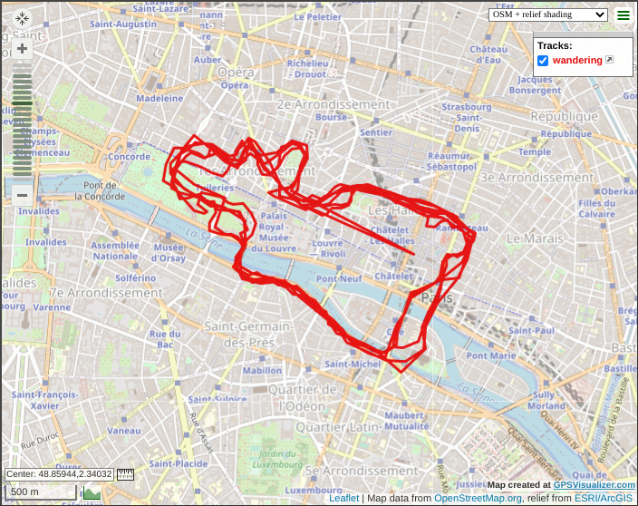
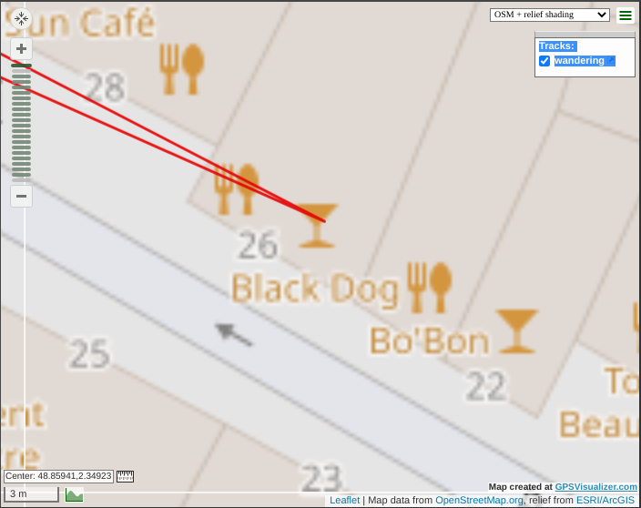

# follow me

Category: Level03  
Tag: GEOINT  
Type: Automatic  
Flag: `APT{2f00d94e6cfcf73f0a112f88d4766fbdc3364a653701c123e5065c1b1367a377}`  
Or flag: `APT{ee4da21057fd49a98e61c043937a845753a7c3953c7c98ad52d68b40e03a2db1}`  
Points: 70  
Requirements: intercepted

## Message

You found James Wang. You got the phone back. Congratulations, Agent! Everyone is very proud of you! We hope to catch the hacker soon.

\* *bip* \*

What was that noise? Seems like the phone just rang and we received a text message.

*"Clap clap. You've done well so far, but just because I allowed you to! I challenged you on purpose. Yeah. All this little game was all made up indeed.  
Let's see if you are as skilled as you pretend to be. I left something for you in this phone: the GPS data of my daily walk. I enjoy my daily walk a lot. Can you find the location of my hacker headquarters? It has a very special name.  
Find me and I promise I'll explain to you why I'm so angry towards 42."*

In a hurry, you download the dataset and start to look for the headquarters' location.

To solve this challenge, submit the SHA-256 hash of the location's name. Pay attention to capital letters.

For example, if "My Flag" is the location's name:
```
echo -n "My Flag" | sha256sum
2b48dba8e6ffa9d6bccc9ec829b8a26a00bfca97736c4bf18181300be7f2df0d
```

Submit the flag as follows:  
`APT{2b48dba8e6ffa9d6bccc9ec829b8a26a00bfca97736c4bf18181300be7f2df0d}`

## Solution

Open the csv file in a vizualizer such as: https://www.gpsvisualizer.com/

<p align="center">
  
  
</p>

Line 54: `2.349234411565736,48.859425557543304,32.47804066652161` -> Le Black Dog

Two flags are accepted:

```
echo -n Black Dog | sha256sum
2f00d94e6cfcf73f0a112f88d4766fbdc3364a653701c123e5065c1b1367a377

echo -n Le Black Dog | sha256sum
ee4da21057fd49a98e61c043937a845753a7c3953c7c98ad52d68b40e03a2db1
```
