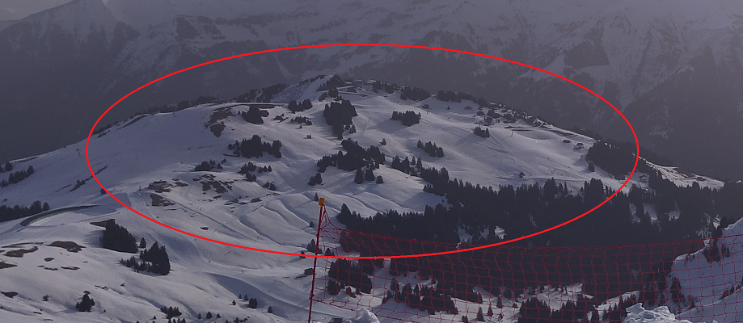
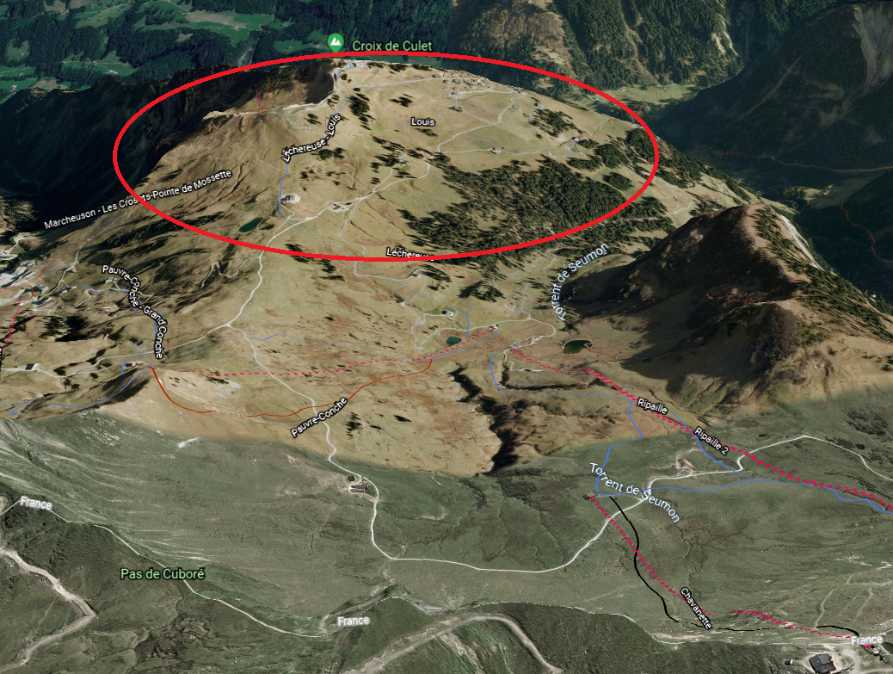

# geoguessr2

Category: Level03  
Tag: GEOINT  
Type: Automatic  
Flag: `APT{916154debfb1a3c932e9fa501d2eff53fc3ab6054933a53237e7e35fe9f60a2b}`  
Points: 100  
Requirements: geoguessr  

## Message

One of our contributors went to the small town where the video was taken.  
Below the structure shown in the video, pinned to one of the pillar, a picture was found.  
The sea harmed it a bit but our awesome AI managed to upscale it by a lot.  
It seems like this investigation looks more and more like a treasure hunt. Hope we won't find anything crazy...  
Anyway, once again, your job is to find the location of this picture, we are sure something relevant will appear if you succeed.  
One of our contributors recognized part of the picture and told us it was probably taken in Western Europe, probably in the Alps.  

To solve this challenge, submit the SHA-256 hash of the chairlift name.

For example, if "Pengelstein 1" is the chairlift name (see right side of the photo):
```
echo -n "Pengelstein 1" | sha256sum
94f1755fd09702dfade94d2e848150142c95bbbce4e866d754bb79d93d0a2fe9
```

Submit the flag as follows:  
`APT{94f1755fd09702dfade94d2e848150142c95bbbce4e866d754bb79d93d0a2fe9}`

## Hint (cost: 35 pts)
The mountain in the background is a little famous, try to enumerate.  
We name things the way they look like to us. (query in French)  

"It is often difficult to wash them" (query in French)

## Solution
Photo is taken towards east, query most known mountain in the Alps, if you enumerate the mountains you will find the "Dents du Midi".  
Try to find this location in google earth.  
  
There arent many places like this in google earth in the west side of the "Dents du Midi".  
  
You see three chairlifts that go high enough on the map, grab pictures of the three and see that the right one is Chavanette.  

echo -n "Chavanette" | sha256sum  
916154debfb1a3c932e9fa501d2eff53fc3ab6054933a53237e7e35fe9f60a2b  
APT{916154debfb1a3c932e9fa501d2eff53fc3ab6054933a53237e7e35fe9f60a2b}  
