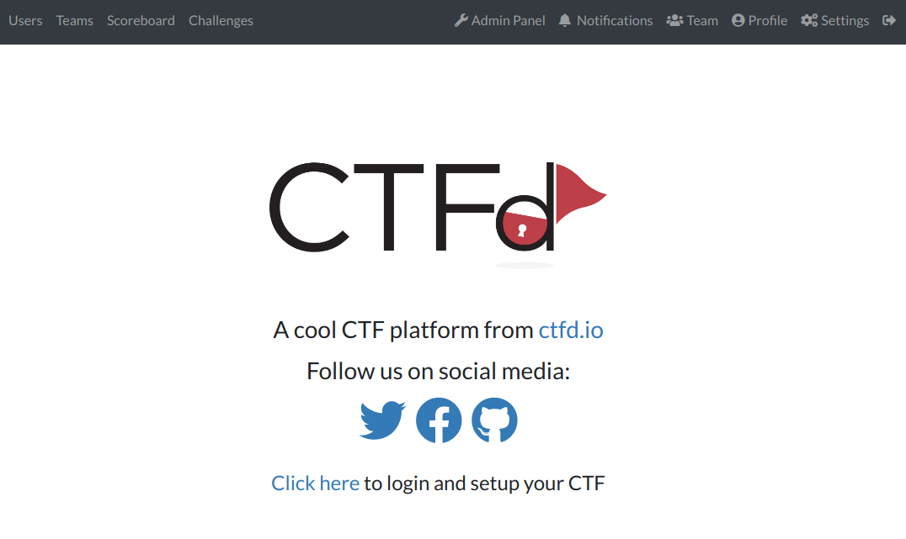
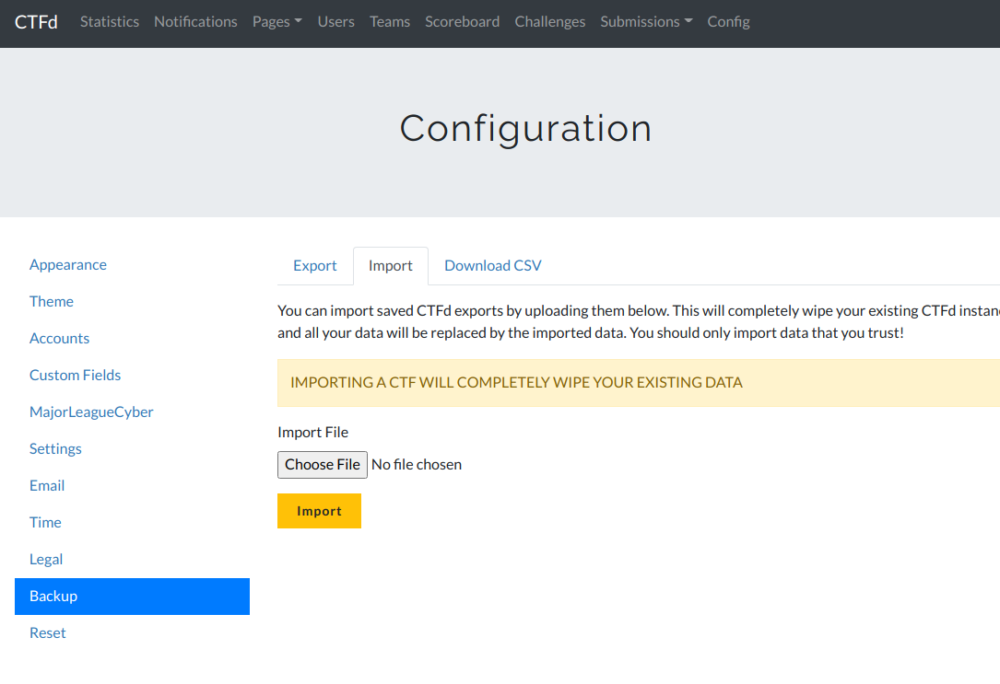
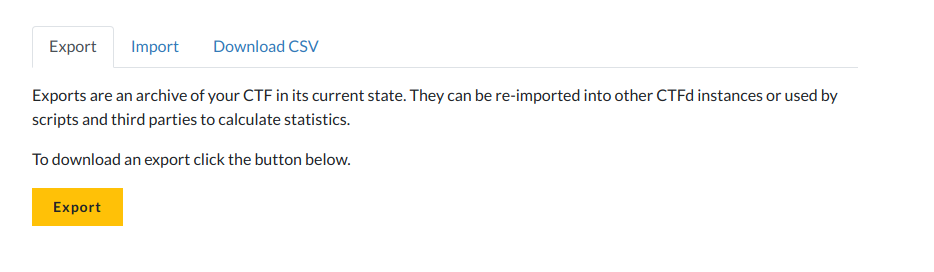

# Local CTFd instance

## Prerequisites

- Clone the `ctf_osint` repository.
- Ensure that `instance-config` is your working directory.
- Docker is installed and started.

## First installation

You will do the following steps only the first time.

Clone the repository and run:
```console
make docker-run
```

Open your web browser and visit `http://localhost:8000`. Follow the step to create an account with random values. These values will be overwritten when you will import the backup file. Once setup process is complete, you will get this page:

<p align="center">
  
</p>

Click on `Admin Panel`.

Then click on `Config` > `Backup` > `Import`. Choose the latest backup file from the `backup` directory.

<p align="center">
  
</p>

The login is (case-sensitive): `Admin`  
And pass is: `youshallnotpass`

Make any changes you want to. Save them by exporting a backup: `Config` > `Backup` > `Export`.

<p align="center">
  
</p>

Put this zip file in the `backup` directory:

```
└── instance-config
    └── backup					# All backup files for the instance
```

All backup files will be gathered in `backup`.

Stop the container:
```console
make docker-stop
```

## Usage

Whenever you need to use the container again, start is as follows:
```console
make docker-start
```

Open your web browser and visit `http://localhost:8000`. Once done, stop the container.

## Common tasks

Stop the container:
```console
make docker-stop
```

Remove the container:
```console
make docker-rm
```

Remove the container and the image:
```console
make clean
```
